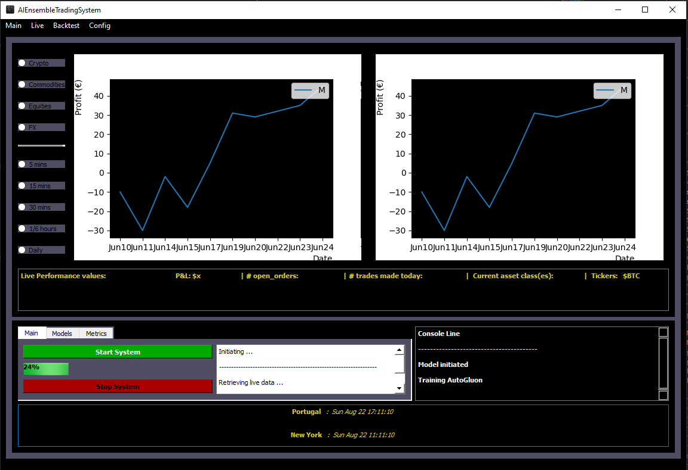

<h1 align="center">AI Ensembled Trading System</h1>

<h2 align="center">

<p align="center">


</p>


## Description

System is composed by 4 folders: 
- **Strategies** (where I am only going to upload 2 basic examples) 
- **Utilities**
- **GUI** 
- **DB**

Data is retrieved using [ib_isyinc](https://github.com/erdewit/ib_insync) and [ccxt](https://github.com/ccxt/ccxt) which can be stored in a local SQLite3 database for further usage.

Current state: Compute +80 TA indicators and ~10 other features from OHLCV data queried from SQLite DB (NLP, vol, range, order book imbalance, etc) --> Principal Component Analysis --> Ensemble[AutoGluon (ML ensemble: 52% accuracy OOS), Facebook Prophet, more to be added] 

Furthermore, a GUI is also being configured (built using PyQT5) for visual assistance where you can see a live P&L graph, models training and performance and order log. Tick interval for data to be downloaded can also be configured here




### Setup

```
webscrapingIBSite.py # Get csv file with all available tickers to trade
create_DBs.py
populate_DBs.py
get_prices.py # Use Windows Task Scheduler, Crontab or Docker to run this script every x interval

main.py 
```

This project is also my Master thesis which I will present in January and as such, until then, regular updates will be made to this repo.
